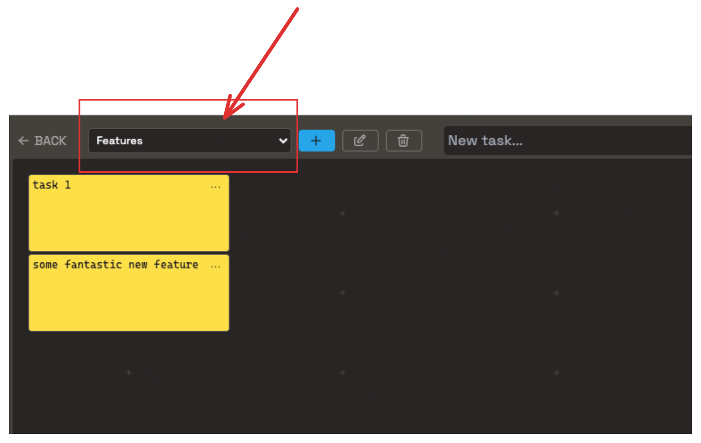

# New select UI component

I need a new select UI component that shows options on hover.

I will use it to replace the current select in TodoBoard.vue

The desired behavior is to show options on hover.
Then I'll just click on an option to select it.

You should implement the new component in src/modules/ui/components/BxHoverSelect.vue

using Composition API and Tailwind CSS